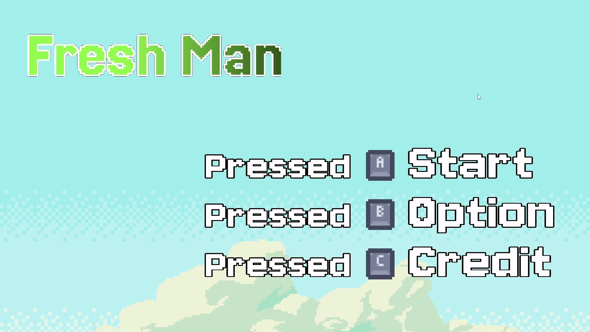
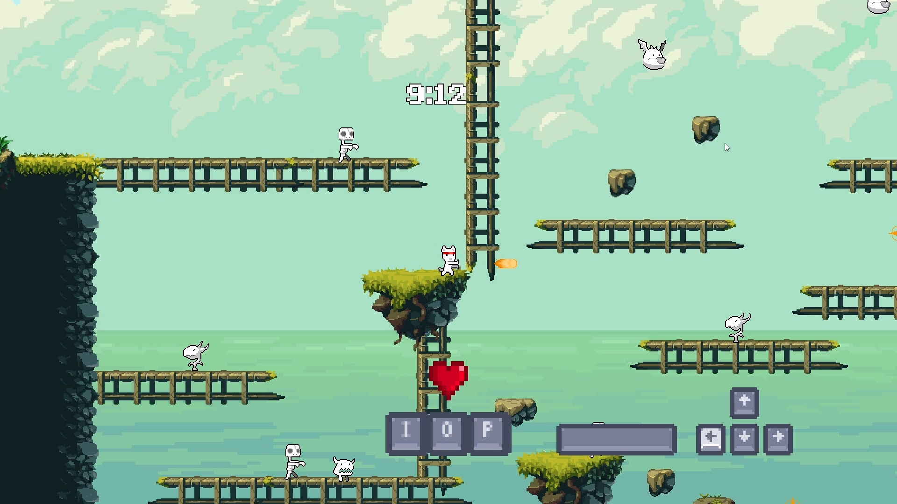
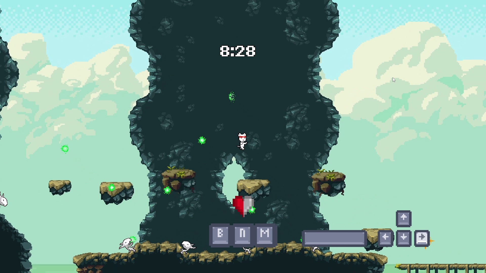

# Fresh Man

  

DirectX 11과 C++를 기반으로 자체 게임 엔진과 에디터를 구현하고, 이를 활용해 2D 게임 콘텐츠를 제작한 개인 프로젝트입니다.

게임 오브젝트와 컴포넌트 구조를 직접 구현하고, 렌더링, 충돌 처리, 에셋 관리, 레벨 관리 및 자체 에디터 기능을 구성했습니다.

본 리포지토리는 DirectX 11 기반 게임 엔진과 이를 활용한 게임 콘텐츠의 소스 코드를 포함하고 있습니다.

---

## 프로젝트 소개

본 프로젝트는 DirectX 11 기반의 게임 엔진을 직접 구현하며 게임 엔진의 기본 구조와 게임 실행 흐름을 학습하기 위해 진행한 개인 프로젝트입니다.

게임 오브젝트를 중심으로 컴포넌트와 스크립트를 구성하고, 이를 기반으로 Transform, Renderer, Collider, Camera 등의 기능을 확장할 수 있도록 구현했습니다.

또한 Dear ImGui를 활용하여 게임 오브젝트와 컴포넌트를 확인하고 수정할 수 있는 자체 에디터를 구성했으며, Asset, Prefab, Level 등을 에디터에서 생성하고 관리할 수 있도록 구현했습니다.

엔진 위에서는 플레이어와 적의 상태 기반 행동, 충돌 처리, 레벨 진행 등의 시스템을 구현하여 실제 게임 콘텐츠를 제작했습니다.

| 항목 | 내용 |
| --- | --- |
| 플랫폼 | Windows |
| 개발 언어 | C++ |
| 그래픽 API | DirectX 11 |
| UI 라이브러리 | Dear ImGui |
| 개발 인원 | 1명 |
| 담당 역할 | 엔진 및 게임 클라이언트 프로그래밍 전반 |

---

## Gameplay

| :---: | :---: |
|  |  |

게임 플레이 영상은 아래 링크에서 확인할 수 있습니다.

[Fresh Man Gameplay Video](https://youtu.be/giiFv2sXMus?si=xqEO6lNW48JX_c4-)

---

## Download

게임 실행파일은 아래 링크에서 다운로드 할 수 있습니다.

**Windows**

[Download for Windows](https://thispring.itch.io/fresh-man)

---

## My Role

### Engine Programming

- GameObject 및 Component 기반 객체 구조 구현
- Transform, Renderer, Collider, Camera 등 주요 컴포넌트 구현
- DirectX 11 기반 렌더링 시스템 구현
- 카메라 및 렌더링 도메인 관리
- 레이어 기반 충돌 처리 시스템 구현
- Asset, Prefab 및 Level 관리 시스템 구현
- Dear ImGui 기반 자체 에디터 구현
- 게임 오브젝트 및 컴포넌트 편집 기능 구현

### Game Client Programming

- 플레이어 상태 기반 이동 및 공격 시스템 구현
- 적 상태 기반 AI 행동 구현
- 적 생성 및 전투 시스템 구현
- 체크포인트 및 레벨 진행 구현
- UI, 사운드 및 게임 상태 관리
- 게임 시작, 게임 오버 및 엔딩 레벨 구현

---

# 주요 구현 기능

## GameObject 및 Component 기반 객체 구조

게임 내 모든 객체를 `GameObject`를 중심으로 관리하고, 기능을 Component와 Script 단위로 분리하는 구조를 구현했습니다.

`GameObject`는 여러 Component와 Script를 보유할 수 있으며, 객체 생성 시 필요한 기능을 조합하여 구성할 수 있도록 했습니다.

객체 복제 시에는 기존 객체의 Component와 Script를 단순히 공유하지 않고 `Clone()`을 통해 새로운 객체로 생성하도록 구성했으며, 자식 객체 역시 함께 복제할 수 있도록 구현했습니다.

이를 통해 Transform, Renderer, Collider와 같은 공통 기능을 게임 오브젝트에 조합하여 사용할 수 있도록 구성했습니다.

**관련 코드**

- [GameObject.cpp](https://github.com/Thispring/Fresh_Man/blob/main/DirectX11_Engine/GameClient/GameObject.cpp)
- [GameObject.h](https://github.com/Thispring/Fresh_Man/blob/main/DirectX11_Engine/GameClient/GameObject.h)
- [Component.cpp](https://github.com/Thispring/Fresh_Man/blob/main/DirectX11_Engine/GameClient/Component.cpp)
- [Component.h](https://github.com/Thispring/Fresh_Man/blob/main/DirectX11_Engine/GameClient/Component.h)
- [CScript.cpp](https://github.com/Thispring/Fresh_Man/blob/main/DirectX11_Engine/GameClient/CScript.cpp)
- [CScript.h](https://github.com/Thispring/Fresh_Man/blob/main/DirectX11_Engine/GameClient/CScript.h)

---

## DirectX 11 기반 렌더링 및 카메라 시스템

게임의 메인 루프에서 Level 업데이트 이후 `RenderMgr`를 통해 렌더링을 수행하도록 구성했습니다.

현재 게임 상태에 따라 게임 플레이용 카메라, UI 카메라, 에디터 카메라를 선택하여 렌더링하며, 각 카메라는 렌더링 전에 게임 오브젝트를 정렬한 후 렌더링을 수행합니다.

게임 플레이 상태에서는 Main Camera와 UI Camera를 사용하고, 에디터 상태에서는 별도의 Editor Camera를 사용하도록 구성했습니다.

이를 통해 게임 플레이와 에디터 환경에서 서로 다른 카메라와 렌더링 흐름을 사용할 수 있도록 구현했습니다.

**관련 코드**

- [Engine.cpp](https://github.com/Thispring/Fresh_Man/blob/main/DirectX11_Engine/GameClient/Engine.cpp)
- [RenderMgr.cpp](https://github.com/Thispring/Fresh_Man/blob/main/DirectX11_Engine/GameClient/RenderMgr.cpp)
- [RenderMgr.h](https://github.com/Thispring/Fresh_Man/blob/main/DirectX11_Engine/GameClient/RenderMgr.h)
- [CCamera.cpp](https://github.com/Thispring/Fresh_Man/blob/main/DirectX11_Engine/GameClient/CCamera.cpp)
- [CCamera.h](https://github.com/Thispring/Fresh_Man/blob/main/DirectX11_Engine/GameClient/CCamera.h)
- [Device.cpp](https://github.com/Thispring/Fresh_Man/blob/main/DirectX11_Engine/GameClient/Device.cpp)

---

## 레이어 기반 충돌 처리 시스템

게임 오브젝트가 속한 Layer를 기준으로 충돌 대상을 관리하고, 각 객체에 연결된 `Collider2D`를 통해 충돌을 판정하도록 구현했습니다.

충돌 검사 이전에 제거된 객체나 Collider가 없는 객체를 제외하고, 충돌 중인 객체 쌍을 ID 기반으로 관리했습니다.

두 객체가 처음 충돌한 경우 `BeginOverlap`, 이미 충돌 중인 경우 `Overlap`, 충돌이 종료된 경우 `EndOverlap`을 호출하도록 구성했습니다.

이를 통해 단순한 충돌 여부뿐 아니라 충돌 시작과 지속, 종료 상태를 각각 처리할 수 있도록 구현했습니다.

**관련 코드**

- [CollisionMgr.cpp](https://github.com/Thispring/Fresh_Man/blob/main/DirectX11_Engine/GameClient/CollisionMgr.cpp)
- [CollisionMgr.h](https://github.com/Thispring/Fresh_Man/blob/main/DirectX11_Engine/GameClient/CollisionMgr.h)
- [CCollider2D.cpp](https://github.com/Thispring/Fresh_Man/blob/main/DirectX11_Engine/GameClient/CCollider2D.cpp)
- [CCollider2D.h](https://github.com/Thispring/Fresh_Man/blob/main/DirectX11_Engine/GameClient/CCollider2D.h)
- [Layer.cpp](https://github.com/Thispring/Fresh_Man/blob/main/DirectX11_Engine/GameClient/Layer.cpp)

---

## Asset, Prefab, Level 관리 및 자체 에디터

Dear ImGui를 기반으로 게임 오브젝트와 컴포넌트를 확인하고 수정할 수 있는 자체 에디터를 구현했습니다.

에디터에서는 Asset, GameObject, Prefab, Level 등을 생성하고 저장할 수 있으며, 각각의 기능을 독립적인 Editor UI로 구성했습니다.

`AssetMgr`는 에셋 타입별로 데이터를 관리하고, Key를 기반으로 필요한 Asset을 검색할 수 있도록 구성했습니다.

`PrefabMaker`와 `LevelMaker`에서는 현재 설정된 GameObject와 Level 정보를 저장하여 재사용할 수 있도록 구현했습니다.

이를 통해 엔진 코드만으로 게임 콘텐츠를 구성하는 방식에서 벗어나, 에디터를 통해 게임 데이터를 생성하고 관리할 수 있도록 구성했습니다.

**관련 코드**

- [EditorMgr.cpp](https://github.com/Thispring/Fresh_Man/blob/main/DirectX11_Engine/GameClient/EditorMgr.cpp)
- [EditorMgr.h](https://github.com/Thispring/Fresh_Man/blob/main/DirectX11_Engine/GameClient/EditorMgr.h)
- [AssetMgr.cpp](https://github.com/Thispring/Fresh_Man/blob/main/DirectX11_Engine/GameClient/AssetMgr.cpp)
- [AssetMgr.h](https://github.com/Thispring/Fresh_Man/blob/main/DirectX11_Engine/GameClient/AssetMgr.h)
- [PrefabMaker.cpp](https://github.com/Thispring/Fresh_Man/blob/main/DirectX11_Engine/GameClient/PrefabMaker.cpp)
- [LevelMaker.cpp](https://github.com/Thispring/Fresh_Man/blob/main/DirectX11_Engine/GameClient/LevelMaker.cpp)

---

## 상태 기반 플레이어 및 적 행동 시스템

엔진 위에서 제작한 게임 콘텐츠에서는 플레이어와 적의 행동을 State 클래스로 분리하여 관리했습니다.

플레이어는 Idle, Move, Jump, Melee Attack, Ranged Attack, Special Attack, Death 등의 상태를 가지며, 현재 상태에 따라 입력과 행동을 처리하도록 구성했습니다.

적 역시 Idle, Patrol, Move, Chase, Attack, Damage, Jump 등의 상태를 분리하여 현재 상황에 따라 행동을 전환하도록 구현했습니다.

각 상태를 독립적인 클래스로 구성함으로써 플레이어와 적의 행동 로직을 한 클래스에 집중시키지 않고, 상태별 책임을 분리하도록 구성했습니다.

**관련 코드**

- [PlayerState.h](https://github.com/Thispring/Fresh_Man/blob/main/DirectX11_Engine/GameClient/Source/Content/PlayerState.h)
- [PlayerIdleState.cpp](https://github.com/Thispring/Fresh_Man/blob/main/DirectX11_Engine/GameClient/Source/Content/PlayerIdleState.cpp)
- [PlayerMoveState.cpp](https://github.com/Thispring/Fresh_Man/blob/main/DirectX11_Engine/GameClient/Source/Content/PlayerMoveState.cpp)
- [PlayerMeleeAttackState.cpp](https://github.com/Thispring/Fresh_Man/blob/main/DirectX11_Engine/GameClient/Source/Content/PlayerMeleeAttackState.cpp)
- [EnemyState.h](https://github.com/Thispring/Fresh_Man/blob/main/DirectX11_Engine/GameClient/Source/Content/EnemyState.h)
- [EnemyIdleState.cpp](https://github.com/Thispring/Fresh_Man/blob/main/DirectX11_Engine/GameClient/Source/Content/EnemyIdleState.cpp)
- [EnemyChaseState.cpp](https://github.com/Thispring/Fresh_Man/blob/main/DirectX11_Engine/GameClient/Source/Content/EnemyChaseState.cpp)
- [EnemyAttackState.cpp](https://github.com/Thispring/Fresh_Man/blob/main/DirectX11_Engine/GameClient/Source/Content/EnemyAttackState.cpp)

---

# 사용 기술

| 기술 | 활용 |
| --- | --- |
| C++ | 엔진 및 게임 로직 구현 |
| DirectX 11 | 그래픽 렌더링 구현 |
| WinAPI | Window 및 플랫폼 기능 처리 |
| Dear ImGui | 자체 게임 에디터 UI 구현 |
| FMOD | 게임 사운드 재생 및 관리 |

---

> 본 프로젝트는 DirectX 11과 C++를 기반으로 게임 엔진의 구조와 동작 방식을 학습하고 구현한 개인 프로젝트입니다.
>
> 현재 공개된 코드는 `main` 브랜치 기준입니다.
